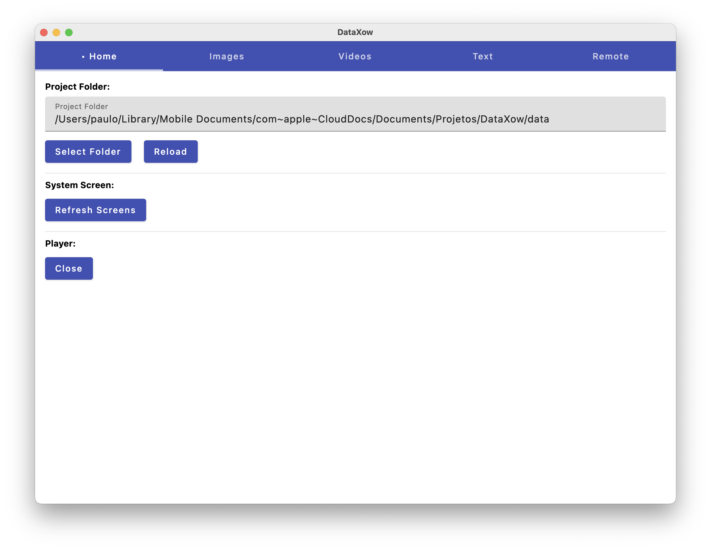
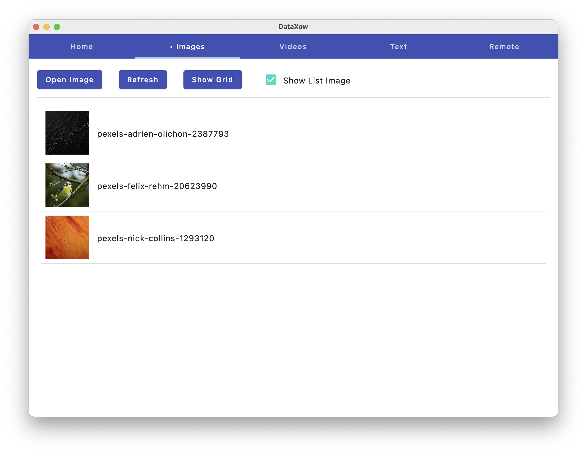
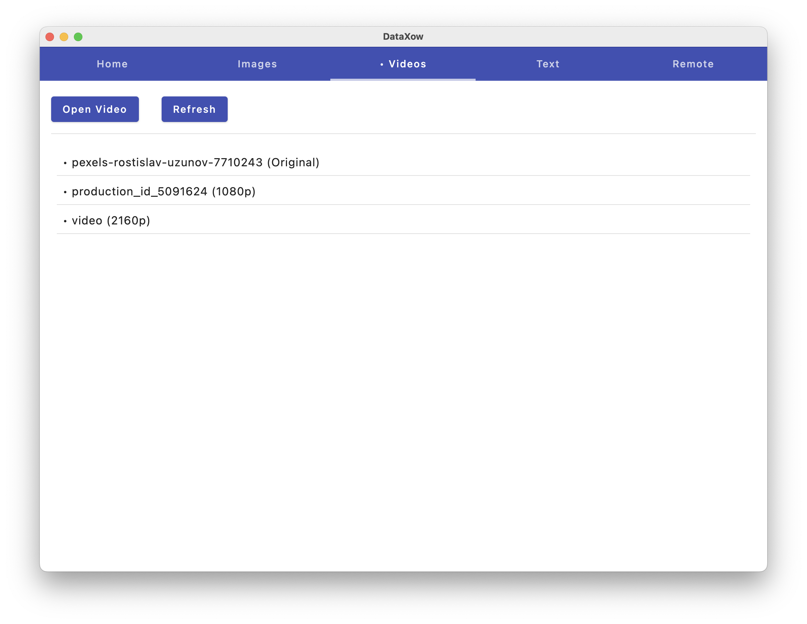
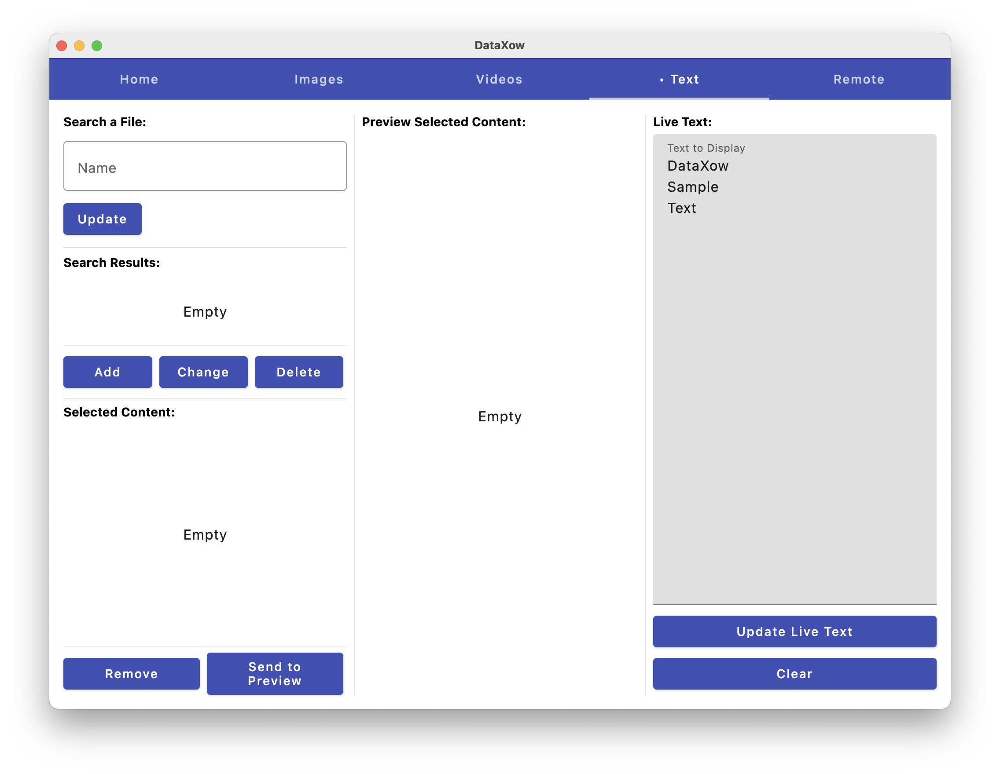
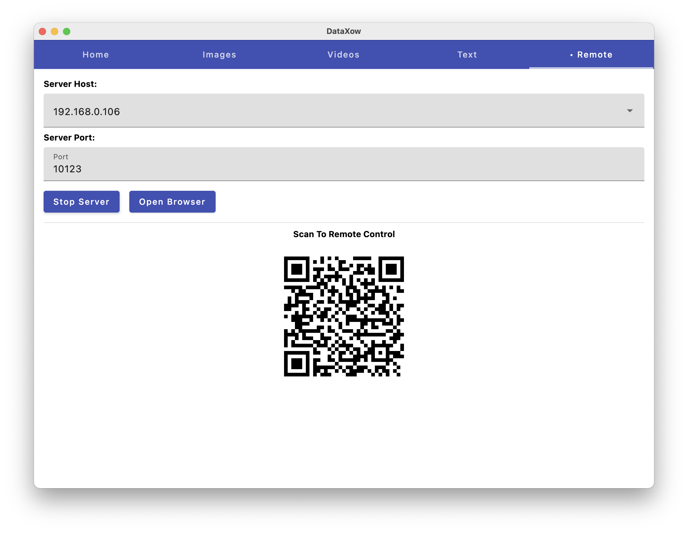
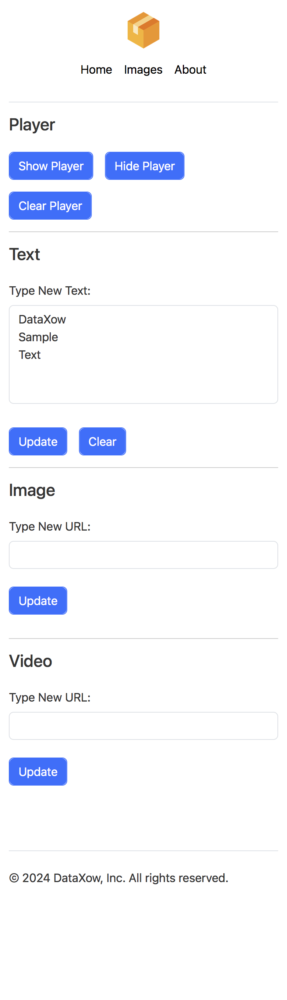

# DataXow

This is a complete datashow application that render text, image and video on other screen devices.

You need install VLC ([https://www.videolan.org/](https://www.videolan.org/)) to play videos.

## Sample Data

You need some data to show. I have prepared a ZIP that contains some texts, images and videos.

Download link: https://www.icloud.com/iclouddrive/001Iot-6ak3ffuqO1S6O25W2Q#data

## Environment Variables

macOS:

- SIGNING_IDENTITY
- NOTARIZATION_APPLE_ID
- NOTARIZATION_TEAM_ID
- NOTARIZATION_PASSWORD

## References

- Native Distribution: https://github.com/JetBrains/compose-multiplatform/blob/master/tutorials/Native_distributions_and_local_execution/README.md

## Screenshots

**Home**

**Images**

**Videos**

**Text**

**Remote**

**Mobile**

